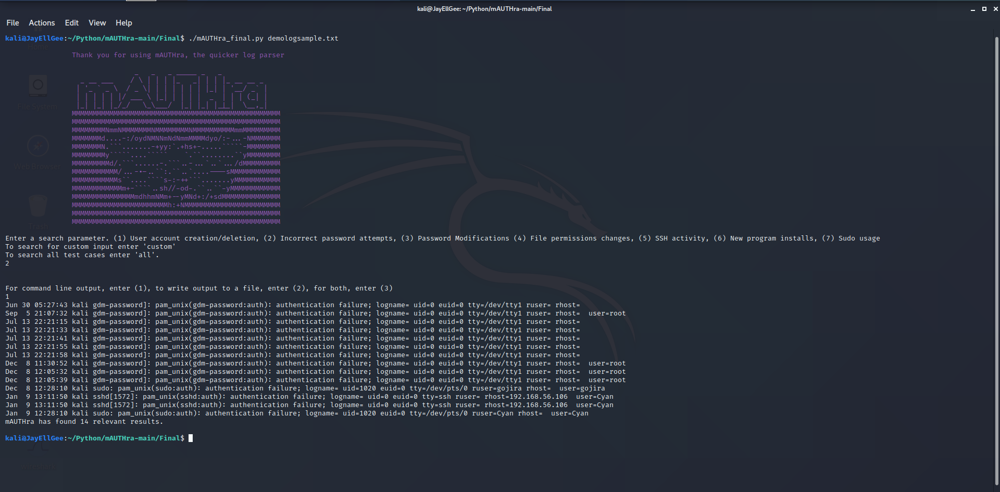

# mAUTHra
> A fast, lightweight log-parsing python3 program.

## Table of contents
* [General info](#general-info)
* [Screenshots](#screenshots)
* [Technologies](#technologies)
* [Setup](#setup)
* [Features](#features)
* [Status](#status)
* [Contact](#contact)

## General info
Welcome, and thank you for checking out project mAUTHra! This program was created as a group project by four cybersecurity students that wanted to practice their Python scripting skills. mAUTHra is a lightweight, easy to use program containing a suite of pre-built parameters designed to parse Linux authorization (and other) logs.
## Screenshots

## Technologies
* mAUTHra utilizes the Python3 language.

## Setup
To set up mAUTHra, simply: 

* Create a directory for mAUTHra and clone the git repo at (https://github.com/ateamproject2021/mAUTHra/tree/main/Final)
* Give mAUTHra_finaly.py executable priveleges: `chmod +x mAUTHra_final.py`

## Code Examples
To launch mAUTHra, simply run it like any executable in Linux and provide it a local file or file path to parse:
`./mAUTHra_final.py (filepath to log file)`

## Features
mAUTHra features a pre-written suite of functions used to parse for specific types of logs. By default, every command except for "New Program Installs" should be searching against your authorization logs (auth.log) found in `/var/log`. "New Program Installs" should be parsed from the Debian Package log (dpkg.log), also found in `/var/log`.
* User account creation and deletion (includes groups)
* Incorrect password attempts
* Password modifications
* File permission changes
* SSH activity
* New program installs
* A custom command (search for a string provided by the user)
* An 'all' command (will execute each module one at a time in a single command)
* The ability to display your output via command line, output to a file of your choosing, or both.

To-do list:
* Future code optimization/cleanup
* Improve utility with extra search parameters

## Status
Project is: _in progress_. As a learning tool for it's developers, we hope to continue to use mAUTHra as a way to improve our Python scripting abilities.

## Contact
* Stephen Koplik
* Joshua Gregoire (https://www.linkedin.com/in/joshualgregoire/)
* Matthew Landry (https://www.linkedin.com/in/matthewlandryml/)
* Phillip Trimble
